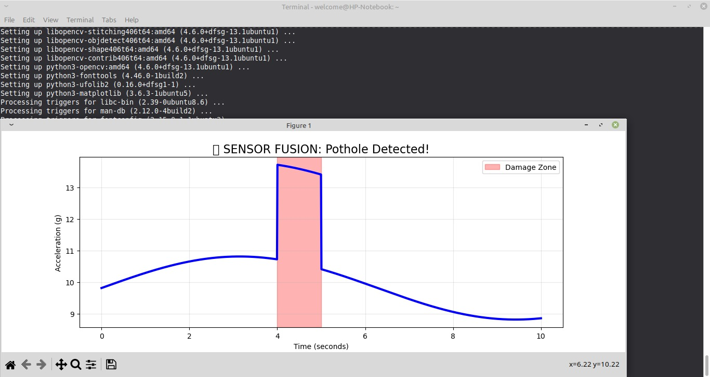
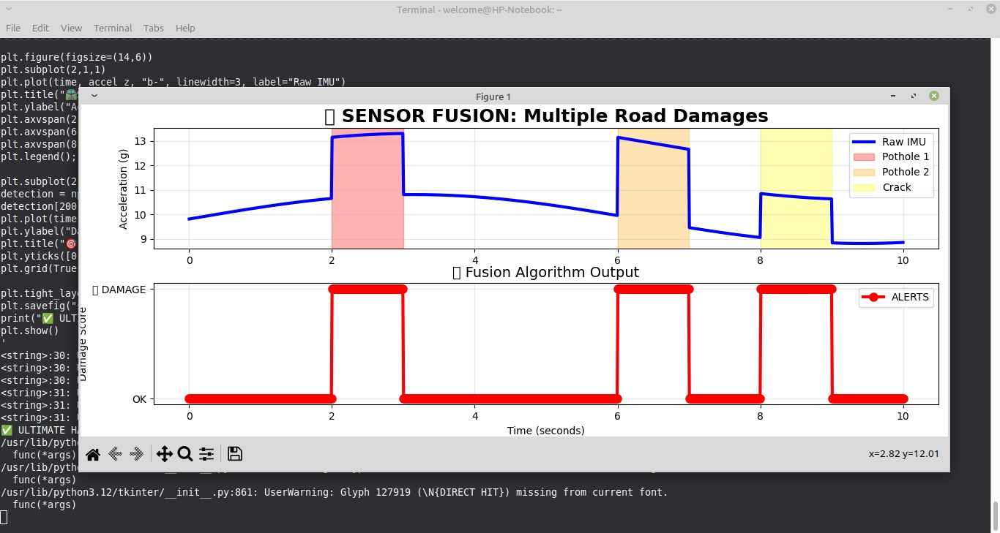

# Sensor-Fusion Based Road Damage Detection System

## Problem Context
Manual road inspections are infrequent, subjective, and expensive, allowing small surface defects to evolve into hazardous potholes before timely intervention.

This project focuses on **continuous, objective road-condition assessment** using vehicles already operating on city roads (municipal fleets, transit, etc.), without requiring dedicated inspection infrastructure.

---

## Simulation Demos

### Single Pothole Detection
The graph below shows raw IMU acceleration data (blue line) during a simulated drive. When the vehicle hits a pothole, acceleration spikes sharply. The fusion algorithm identifies the damage zone (pink highlight) and raises an alert.



### Multiple Road Damages
This simulation shows the system detecting multiple damage events across a 10-second drive — two potholes and a crack. The top graph shows the raw IMU signal. The bottom graph shows the fusion algorithm output, switching between OK and DAMAGE states in real time.



---

## System Overview
The proposed system is a **vehicle-mounted road condition monitoring solution** that detects potholes and surface damage by integrating:

- Dashcam-based computer vision
- Laser Time-of-Flight (ToF) depth sensing
- GPS-based geo-tagging

The system is designed to operate on an **edge computing device mounted inside the vehicle**, enabling real-time assessment under real-world driving conditions with **minimal additional infrastructure**.

A key design principle is to **separate detection from verification**, ensuring useful data is not discarded while avoiding false confidence.

---

## Architecture & Design Rationale
- Dashcams provide **wide-field coverage** across full road lanes.
- Vision-based detection enables identification of damage even in lanes the vehicle may not traverse.
- Edge AI performs real-time detection to avoid cloud dependency.
- A Laser Time-of-Flight sensor array (e.g., VL53L1X) provides **quantitative depth and surface profiling** where vision alone is unreliable.
- Sensor fusion enables **severity estimation**, rather than binary detection.
- GPS data is sourced from the dashcam when available; otherwise, a dedicated GPS module within the pothole unit is used for geo-tagging.
- Fleet-based deployment allows **easy integration with existing government vehicles**.

---

## Edge-First Processing
All perception, verification, and fusion logic runs **locally on the vehicle** to ensure:

- Low-latency operation
- Reduced bandwidth usage
- Robustness in low-connectivity environments

Only validated, low-volume metadata is transmitted for centralized road condition mapping.

---

## System Architecture
```
Dashcam (YOLO)
↓
Perception Verification
↓
Laser Depth Sensing
↓
Sensor Fusion & Severity
↓
GPS Geo-Tagging
↓
Map-Ready Output
```

---

## Detection and Verification Logic

### Vision-Based Detection
- A YOLO-based model detects potholes and cracks from dashcam images.
- Detection covers the **full road width**, including adjacent lanes and road shoulders.

### Verification Concept (Unverified Detections)
- Laser sensors only cover a **limited area directly under and near the vehicle**.
- Visual detections outside laser coverage are **not discarded**.
- Instead, they are explicitly tagged as:
```
verification = "unverified"
```

These unverified detections:
- Are visualized separately (e.g., blue markers on the map)
- Can be confirmed later by another vehicle pass
- Prevent loss of potentially important road damage data

This enables **fleet-level confirmation** without overclaiming accuracy.

---

## Sensor Fusion and Severity Estimation
- Laser depth data is used to estimate damage severity:
  - Low
  - Moderate
  - Severe
- **Variation across multiple laser sensors** is analyzed to distinguish potholes from uniform road features such as speed breakers.
- Severity is assigned **only when depth data is available**.
- Vision-only detections retain:
```
severity = "unknown"
```

This ensures conservative and explainable outputs.

---

## Mapping Output
Each detected road issue is exported in a map-ready format including:
- Latitude and longitude
- Damage type
- Severity (if available)
- Verification status (verified / unverified)
- Detection confidence

This supports:
- Color-coded visualization
- Maintenance prioritization
- Continuous road condition monitoring

---

## Feasibility
- Utilizes **existing dashcams**, keeping hardware costs low.
- Requires only **compact laser sensors** for depth measurement.
- Runs on a **single edge computing device**.
- Easily scalable across large vehicle fleets.
- Supports offline operation with delayed data upload.

---

## Optional Preventive Extension (Future Scope)
For low-speed municipal vehicles (e.g., garbage trucks), the system can optionally flag eligible micro-cracks (<1 cm) for automated preventive sealing to limit water ingress and delay pothole formation.

This extension is intentionally constrained and rule-based to ensure safety, feasibility, and regulatory compatibility.
It is **not part of the core detection pipeline**.

---

## Scope & Limitations
- This repository demonstrates **system logic and architectural feasibility**.
- Real-world calibration, camera–laser spatial alignment, and large-scale validation are outside the current scope.
- Regulatory approvals and on-road deployment testing are not covered here.

---

## Repository Structure
```
perception/
├── image_detection.py
└── detection_verification.py

depth/
└── laser_depth_reader.py

fusion/
└── road_damage_assessment.py

edge/
└── edge_pipeline.py

gps/
└── geo_tagging.py

prevention/
└── crack_sealing_logic.py

demo/
├── demo_single_pothole.jpg
└── demo_multiple_pothole.jpg
```

---

## Current Status
- Architecture finalized
- Detection, verification, and fusion logic implemented
- Edge pipeline operational
- Sensor fusion simulations complete
- Ready for prototype integration with real sensors and YOLO inference

---

## References
- YOLO-based road damage detection and segmentation adapted from public research and Kaggle implementations.
- VL53L1X Time-of-Flight sensor documentation and related depth-sensing literature.

---

## Summary
This project presents a **practical, edge-first, and scalable approach** to road condition monitoring.
By explicitly handling uncertainty and leveraging fleet-level confirmation, it avoids common pitfalls of single-sensor or purely vision-based systems.
